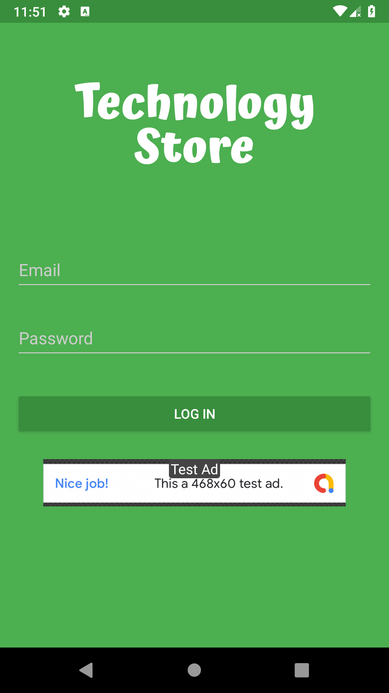
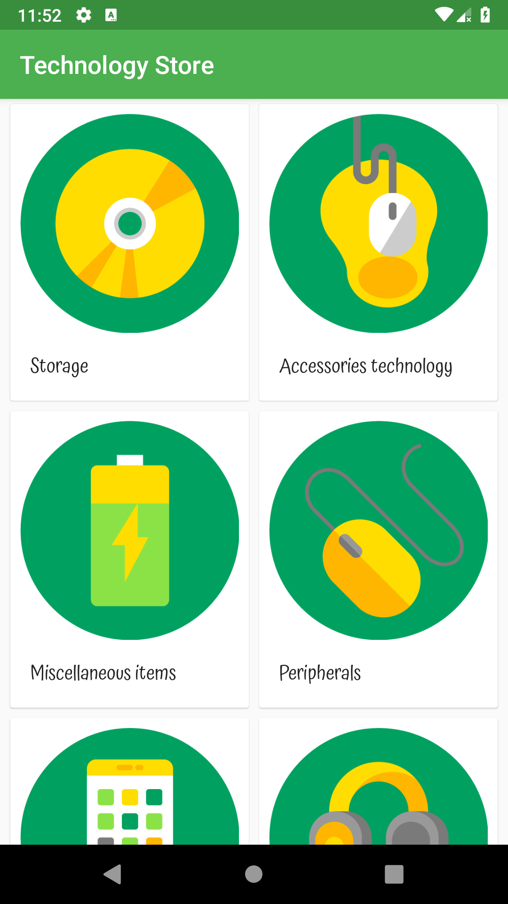
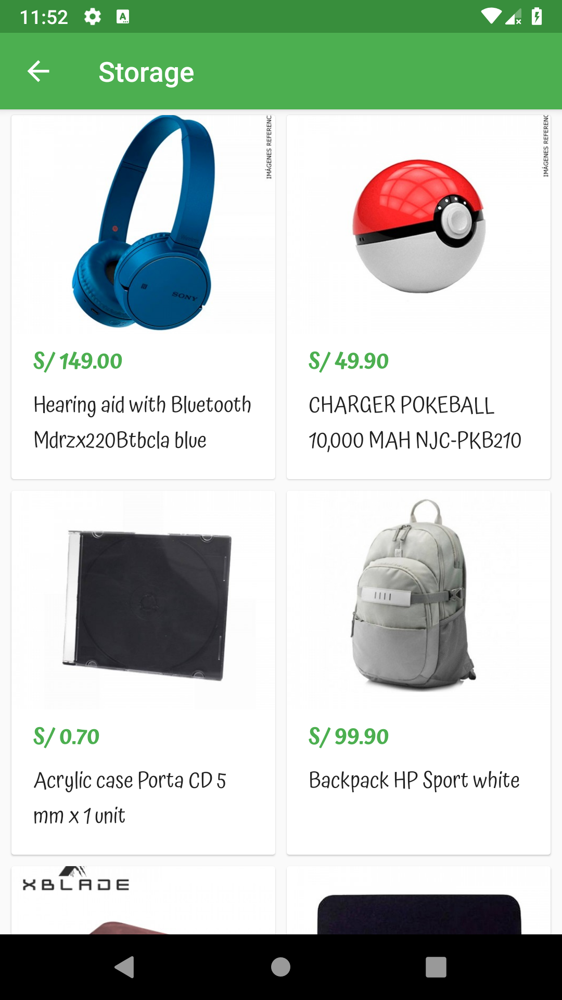
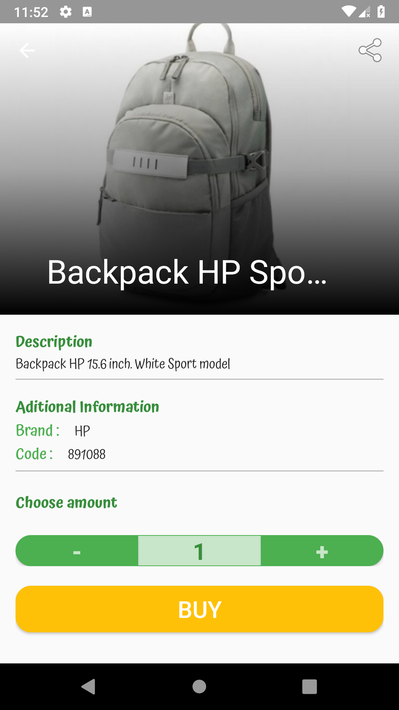
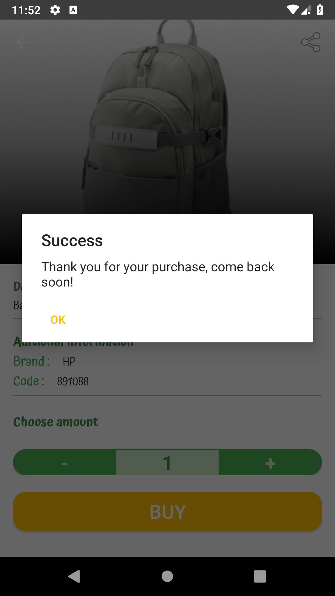
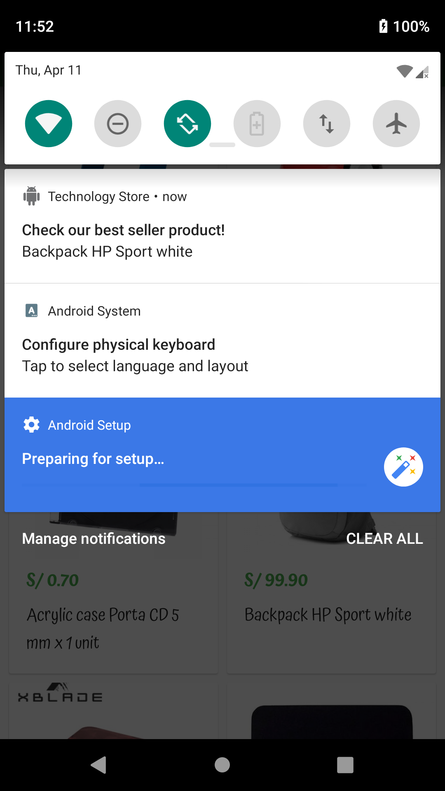

# Techstore App

I already finish [The Android Developer Nanodegree](https://www.udacity.com/course/android-developer-nanodegree-by-google--nd801)
and it was one of the most beautiful courses for Android that I did. One of the goals of this program is develop
your own application. Well, I developed Techstore app.

All the requirements are explained [here](requeriments/techstore_requirements.pdf)

### Description
Technology use in schools is increasing every year, dominated by the introduction of tablets and netbooks to the classroom. 
It is not intended to replace teacher in the classroom; instead, most educational tech is designed to increase efficiency and improve the effectiveness of traditional teaching methods. 
In order to get these technology for you. Always wanted to shop everything related with technology in one place, at one time and free shipping as well? Well. 
We have got just the right app for you.

### Screenshots

<p align="center">
      
    
       
</p>
<p align="center">
    
    
       
</p>

## Features

   * Clean architecture (Presentation, domain and data layer)
   * Dagger 2 as Dependency Injector
   * Retrofit as Http client
   * Butterknife for binding views
   * Timber for show logs
   * Glide for loading images
   * Architecture components( LiveData, ViewModel and Room)
   * Espresso for UI testing
   * Material Design metrics ( Shared elements activity transition, Collapsin toolbar, etc) 
   * Notifications
   * WorkManager( In order to schedule a notification the application make it with WorkManager)
   * Widget(It has a widget for the last product bought)
   * Firebase Analytics
   * Admob( It show ads in the login view)
   * Share Button ( It can share a product)
   
   
## Development

### Dependencies

As you can see this project has a lot of dependencies, in order to do it more clean I organize all
the dependencie in another file, it has all the dependencies and two final variables, 
one for development and the another for testing.

```
     androidBuildTools = "28.0.3"
    androidMinSdk = "21"
    androidTargetSdk = 28
    androidCompileSdk = 28

    versions = [
            androidMaterial : "1.0.0",
            constraintLayout: "1.1.2",
            glide           : "4.9.0",
            butterknife     : "10.1.0",
            retrofit        : "2.5.0",
            okhttp          : "3.14.0",
            dagger          : "2.21",
            room            : "2.0.0-rc01",
            lifecycle       : "2.0.0",
            timber          : "4.7.1",
            debugDb         : "1.0.6",
            workManager     : "2.0.0",
            espresso        : "3.1.0",
            firebase        : "16.0.8",
            ads             : "17.2.0",
            atsl            : "1.1.0"
    ]
```
### Signing configuration
One of the requirements was to add signing configuration for release buildType.
Since this project is a demo, I add the credentials in the repository. But it is a bad practice, in real projects
those credentials **must be** in a properties file and import it from gradle.
```
    signingConfigs {
        release {
            storeFile file('../dependencies/release.keystore')
            storePassword 'j9!b6!x9!'
            keyAlias 'techstore'
            keyPassword 'j9!b6!x9!'
        }
    }
```
Finally, add the _signingConfigs_ for release
```
    buildTypes {
        release {
            minifyEnabled false
            signingConfig signingConfigs.release
            proguardFiles getDefaultProguardFile('proguard-android-optimize.txt'), 'proguard-rules.pro'
        }
    }
```
## Contribute

Feel free to contribute either by requesting features or collaborating with new articles.

* [Clone the repo](https://github.com/RaulitoGC/Technology-Store-App).
* Create a branch off of master and give it a meaningful name (e.g. my-new-feature).
* Open a pull request on GitHub and describe the feature, fix or post.

## Discusions
Refer to the issues section: [https://github.com/RaulitoGC/Technology-Store-App/issues]
   
## Author
Raul Guzman - @RaulitoGC on GitHub, @rguzman66 on Twitter, 

