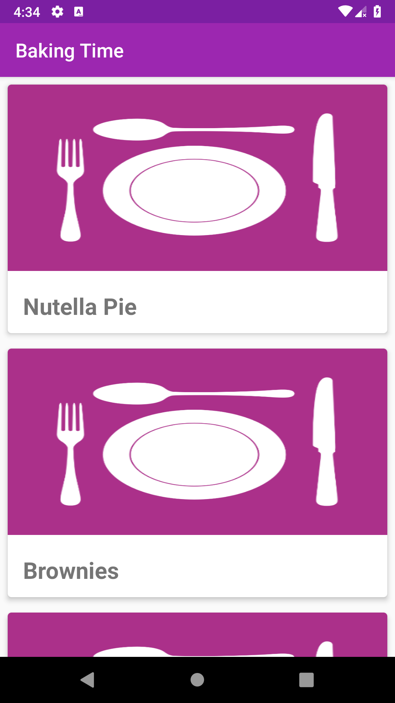
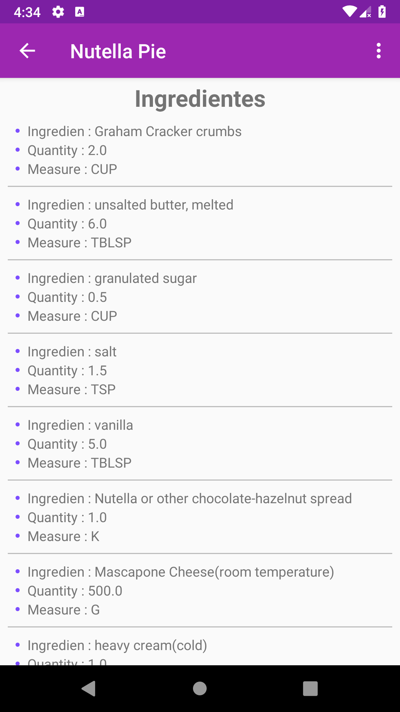
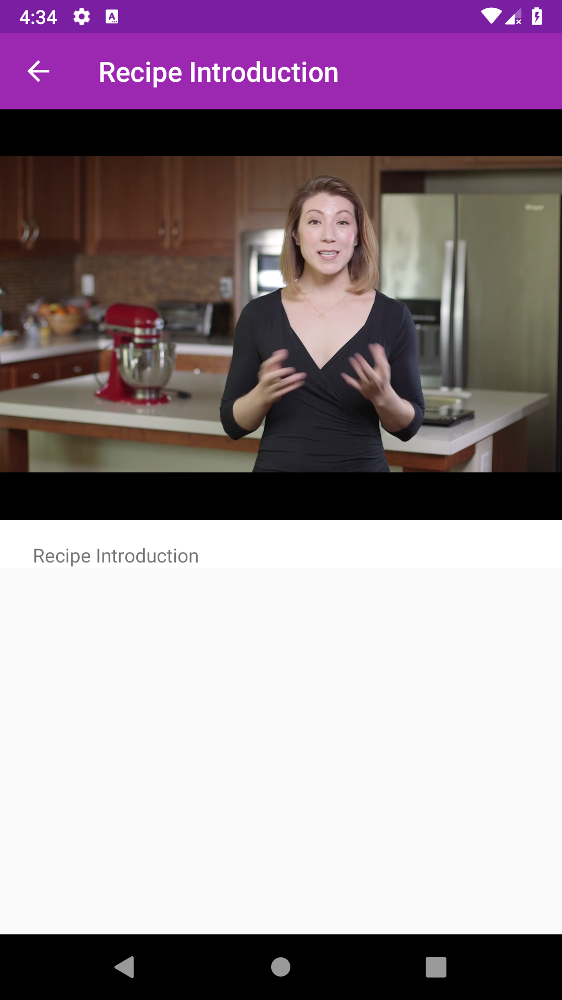
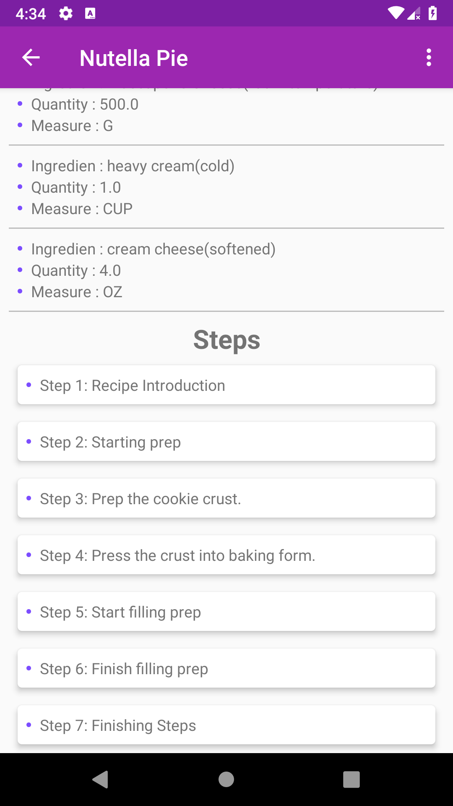
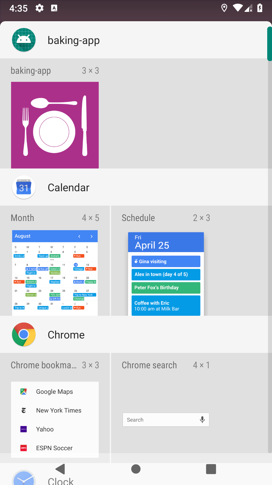
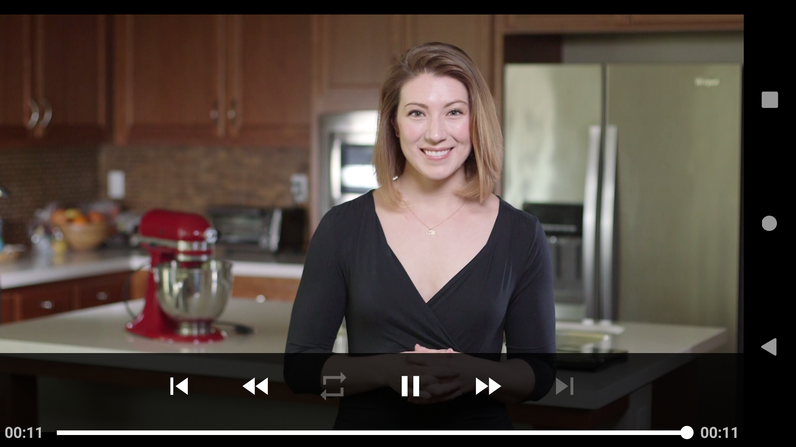
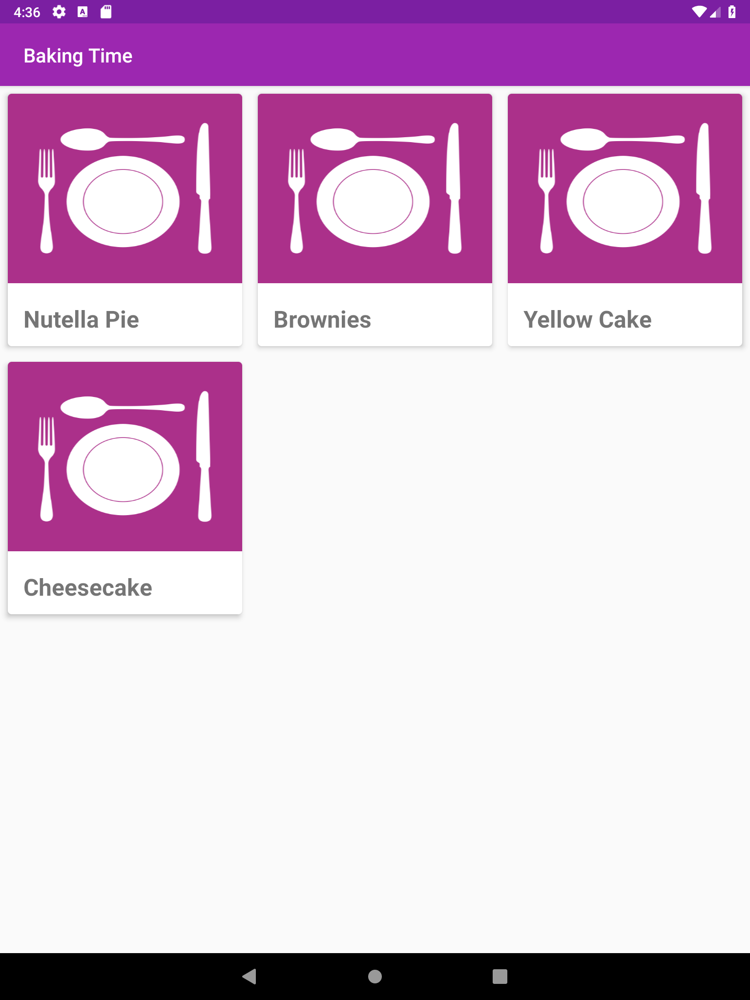
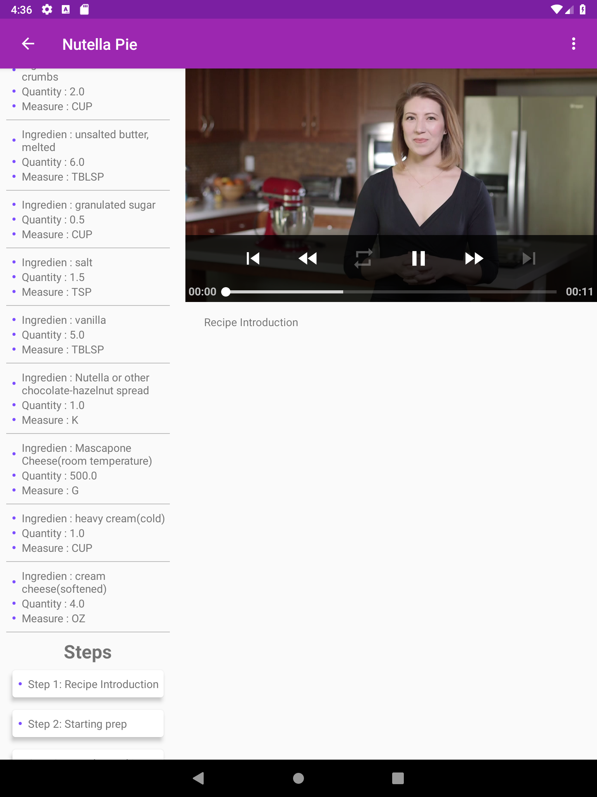
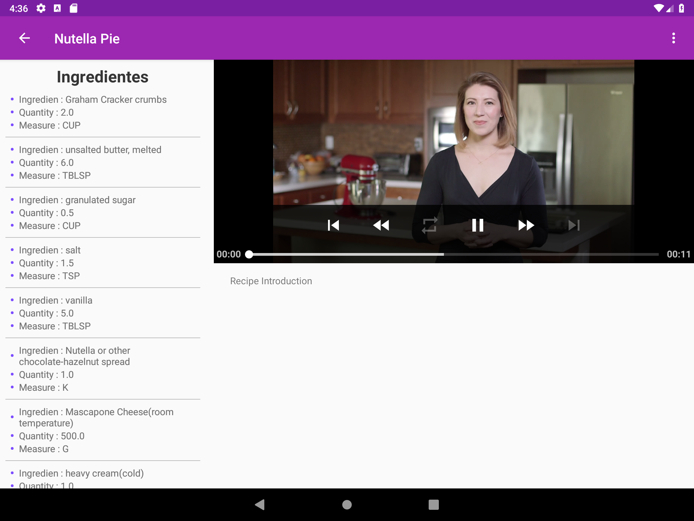

# Udacity-Baking-App

As part of series of projects from Udacity, Baking 
 is the project
about how to use Exoplayer API and how to manage differente types of
size in Android such as Tablet and Smartphone.

### Screenshots

* Smartphone
<p align="center">
      
    
    
    


</p>

* Tablet

<p align="center">
      
    
    
</p>

## Features

   * Clean architecture (Presentation, domain and data layer)
   * Dagger 2 as Dependency Injector
   * Retrofit as Http client
   * Butterknife for binding views
   * Timber for show logs
   * Glide for loading images
   * Espresso for UI testing 
   * Architecture components( LiveData and ViewModel)
* Widget( It shows all the steps for a recipe)
   
## Development

### Dependencies

As you can see this project has a lot of dependencies, in order to do it more clean I organize all
the dependencie in another file, it has all the dependencies and two final variables, 
one for development and the another for testing.

```
     //Android
     androidBuildToolsVersion = "28.0.3"
     androidMinSdkVersion = 21
     androidTargetSdkVersion = 28
     androidCompileSdkVersion = 28
 
     //Libraries
     androidConstraintLayoutVersion = '1.1.0'
     androidSupportVersion = '28.0.0'
     glideVersion = '4.8.0'
     butterKnifeVersion = '8.8.1'
     retrofitVersion = '2.5.0'
     daggerVersion = '2.17'
     okHttpVersion = '3.12.1'
     timberVersion = '4.7.1'
     roomVersion = '1.1.1'
     lifecycleVersion = '1.1.1'
     debugDbVersion = '1.0.4'
     exoPlayerVersion = '2.6.1'
 
     // Test
     espressoVersion = '3.0.2'
     testRunnerVersion = '1.0.2'
     testRulesVersion = '1.0.2'
```
### Exoplayer

*  Add the _**com.google.android.exoplayer2.ui.SimpleExoPlayerView**_
   view in the layout desired.

      ```
     <FrameLayout
             android:id="@+id/video_container"
             android:layout_width="match_parent"
             android:layout_height="300dp">
     
             <com.google.android.exoplayer2.ui.SimpleExoPlayerView
                 android:id="@+id/video_view"
                 android:layout_width="match_parent"
                 android:layout_height="match_parent"
                 android:layout_gravity="center"
                 android:background="#000000"
                 app:fastforward_increment="10000"
                 app:repeat_toggle_modes="one"
                 app:rewind_increment="10000" />
     
         </FrameLayout>
        ```
* Since Baking application shows videos, it should be pause when enters
  in background and resume when come back to foreground.
  
  ```
       private void initializePlayer() {
       
               if (player == null) {
                   player = ExoPlayerFactory.newSimpleInstance(
                           new DefaultRenderersFactory(getContext()),
                           new DefaultTrackSelector(),
                           new DefaultLoadControl());
                   playerView.setPlayer(player);
                   player.setPlayWhenReady(playWhenReady);
                   player.seekTo(currentWindow, playbackPosition);
               }
       
               Uri uri = null;
       
               if (!TextUtils.isEmpty(step.getVideoUrl())) {
                   uri = Uri.parse(step.getVideoUrl());
               }
       
               if (uri == null && !TextUtils.isEmpty(step.getThumbnailUrl())) {
                   uri = Uri.parse(step.getThumbnailUrl());
               }
       
               if (uri != null) {
                   MediaSource mediaSource = buildMediaSource(uri);
                   player.prepare(mediaSource, true, false);
               } else {
                   playerView.setVisibility(GONE);
                   videoContainer.setVisibility(GONE);
               }
           }
  ```
  
  ```
       private void releasePlayer() {
               if (player != null) {
                   playbackPosition = player.getCurrentPosition();
                   currentWindow = player.getCurrentWindowIndex();
                   playWhenReady = player.getPlayWhenReady();
                   player.release();
                   player = null;
               }
           }
  ``` 
*   Another feature is the device is rotated from portrait to landscape
    the video will be show in full screen. For develop this feature the
    application add the _**android:configChanges**_ property.

   
    ```
    <activity
                android:name=".presentation.detail.step.RecipeStepDetailActivity"
                android:configChanges="keyboard|keyboardHidden|orientation|screenSize|screenLayout|smallestScreenSize|uiMode"
                android:parentActivityName=".presentation.detail.RecipeDetailActivity" />
      ```
    Now you can override the _**onConfigurationChanged**_ in your
    activity or fragment.
    
    ```
        @Override
            public void onConfigurationChanged(Configuration newConfig) {
                super.onConfigurationChanged(newConfig);
            }
    ```
    Finally in this method you can write your own logic, just validate
    when the device is in Portrait or Landscape.
    ```
           if (videoContainer.getVisibility() == View.VISIBLE) {
                       int currentOrientation = getResources().getConfiguration().orientation;
                       if (currentOrientation == Configuration.ORIENTATION_LANDSCAPE) {
                           openFullscreenDialog();
                       } else {
                           closeFullscreenDialog();
                       }
              }
    ```
### Screen Size 
   
In some cases the application needs to validate if it is running in
tablet or Smartphone, in this application it validate with a single
boolean, but don't forget that android can create resources for
different screen size. 

* Smartphone resource _**res/values/boolean.xml**_ and
  _**res/layout/activity_recipe_detail.xml**_

[](captures/boolean.png)
[](captures/activity_recipe_detail.png)

* Tablet resource _**res/values-sw600dp/boolean.xml**_ and
  _**res/layout-sw600dp/activity_recipe_detail.xml**_
  
  
  [](captures/boolean-sw600dp.png)
  [](captures/activity_recipe_detail_sw600dp.png)

Finally if the application runs in tablet it will take sw-600dp
resources and if is Smartphone it takes the default. 

```
boolean isTablet = getResources().getBoolean(R.bool.isTable);
        if (isTablet) {
            // do something fot tablet
        } else {
            // do something for Smartphone
        }
```

## Contribute

Feel free to contribute either by requesting features or collaborating with new articles.

* [Clone the repo](https://github.com/RaulitoGC/Udacity-Baking-App).
* Create a branch off of master and give it a meaningful name (e.g. my-new-feature).
* Open a pull request on GitHub and describe the feature, fix or post.

## Discusions
Refer to the issues section: [https://github.com/RaulitoGC/Udacity-Baking-App/issues]
   
## Author
Raul Guzman - @RaulitoGC on GitHub, @rguzman66 on Twitter, 

