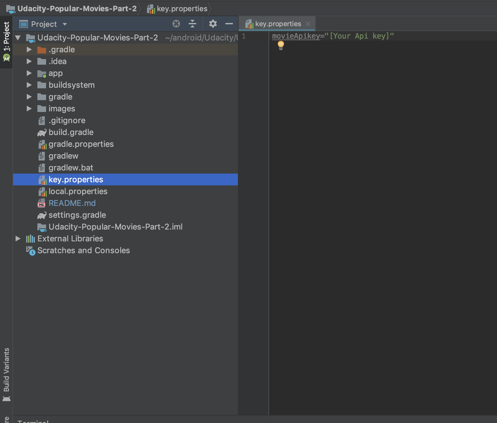

# Udacity-Popular-Movies-Part-1

Welcome to Udacity Popular Movies App part 1!

## How it works

Popular movies app depends on [key.properties] file (This file should be create in the root of the project with the name "key.properties").
In this file you should be add your movieDb Api Key value.

